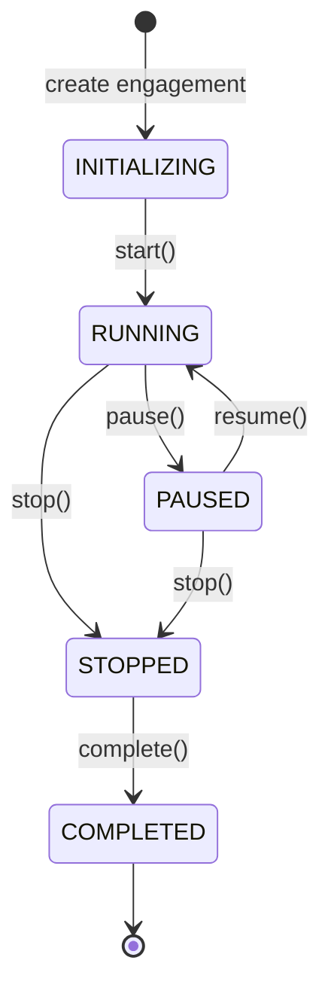

# Story 2.4: Engagement State Machine

Status: done

<!-- Note: Validation is optional. Run validate-create-story for quality check before dev-story. -->

## Story

As a **developer**,
I want **a strict engagement state machine**,
So that **engagements follow predictable lifecycle transitions (FR55-FR61)**.

## Acceptance Criteria

1. **Given** Story 2.2 is complete
2. **When** an engagement is created
3. **Then** it starts in `INITIALIZING` state
4. **And** valid transitions are: INITIALIZING→RUNNING, RUNNING↔PAUSED, RUNNING→STOPPED, PAUSED→STOPPED, STOPPED→COMPLETED
5. **And** invalid transitions raise `InvalidStateTransition` error
6. **And** state changes emit events for subscribers
7. **And** unit tests verify all valid/invalid transitions

## Tasks / Subtasks

> [!IMPORTANT]
> **STATE MACHINE FOUNDATION — Required by SessionManager (Story 2.5) and all engagement lifecycle operations**

### Phase 1: State and Transition Definitions

- [x] Task 1: Define engagement states (AC: #3) <!-- id: 0 -->
  - [x] Create `src/cyberred/daemon/state_machine.py`
  - [x] Define `EngagementState` StrEnum with values: `INITIALIZING`, `RUNNING`, `PAUSED`, `STOPPED`, `COMPLETED`
  - [x] Add docstrings describing each state's meaning and agent/memory status per architecture table
  - [x] Use StrEnum (consistent with `IPCCommand` pattern from Story 2.2)

- [x] Task 2: Define valid state transitions (AC: #4) <!-- id: 1 -->
  - [x] Create `VALID_TRANSITIONS` constant as frozen set of (from_state, to_state) tuples
  - [x] Valid transitions per architecture: 
    ```
    INITIALIZING → RUNNING
    RUNNING → PAUSED
    RUNNING → STOPPED
    PAUSED → RUNNING
    PAUSED → STOPPED
    STOPPED → COMPLETED
    ```
  - [x] Add helper function `is_valid_transition(from_state, to_state) -> bool`
  - [x] Add `get_valid_targets(from_state) -> set[EngagementState]` for UI hints

### Phase 2: Exception and State Machine Class

- [x] Task 3: Add InvalidStateTransition exception (AC: #5) <!-- id: 2 -->
  - [x] Add `InvalidStateTransition` to `src/cyberred/core/exceptions.py`
  - [x] Inherit from `CyberRedError` (consistent with hierarchy)
  - [x] Include `engagement_id`, `from_state`, `to_state` attributes
  - [x] Include `valid_targets` in context() for debugging
  - [x] Update `__init__.py` exports

- [x] Task 4: Create EngagementStateMachine class (AC: #3, #4) <!-- id: 3 -->
  - [x] Create `EngagementStateMachine` class in `state_machine.py`
  - [x] Store `engagement_id`, `_current_state`, `_history: list[tuple[EngagementState, datetime]]`
  - [x] Add `@property current_state` getter
  - [x] Add `transition(to_state: EngagementState) -> None` method that validates before transitioning
  - [x] Raise `InvalidStateTransition` on invalid transitions
  - [x] Log state transitions with `structlog` including `engagement_id`, `from_state`, `to_state`

### Phase 3: Event Emission

- [x] Task 5: Implement state change callbacks (AC: #6) <!-- id: 4 -->
  - [x] Add `_listeners: list[Callable[[EngagementState, EngagementState], None]]` to `EngagementStateMachine`
  - [x] Add `add_listener(callback)` and `remove_listener(callback)` methods
  - [x] Call all registered listeners on successful state transition
  - [x] Handle listener exceptions gracefully (log, don't crash)
  - [x] Add optional async support via `asyncio.iscoroutinefunction()` check

- [x] Task 6: Add convenience transition methods <!-- id: 5 -->
  - [x] Add `start() -> None` (INITIALIZING → RUNNING)
  - [x] Add `pause() -> None` (RUNNING → PAUSED)
  - [x] Add `resume() -> None` (PAUSED → RUNNING)
  - [x] Add `stop() -> None` (RUNNING/PAUSED → STOPPED)
  - [x] Add `complete() -> None` (STOPPED → COMPLETED)
  - [x] Each method validates current state and raises helpful error if invalid

### Phase 4: Testing

- [x] Task 7: Create unit tests for state machine (AC: #7) <!-- id: 6 -->
  - [x] Create `tests/unit/daemon/test_state_machine.py`
  - [x] Test initial state is `INITIALIZING`
  - [x] Test all 6 valid transitions work correctly
  - [x] Test all invalid transitions raise `InvalidStateTransition`
  - [x] Test state history is recorded correctly
  - [x] Test listeners are called on state change
  - [x] Test listener exceptions don't crash state machine
  - [x] Test convenience methods (start, pause, resume, stop, complete)
  - [x] Achieve 100% coverage on `daemon/state_machine.py`

- [x] Task 8: Run full test suite <!-- id: 7 -->
  - [x] Run `pytest tests/unit/daemon/test_state_machine.py -v`
  - [x] Run `pytest --cov=src/cyberred/daemon/state_machine --cov-report=term-missing`
  - [x] Verify 100% coverage on `daemon/state_machine.py`
  - [x] Verify no test regressions (full suite green)

## Dev Notes

### Architecture Context

This story implements the engagement state machine per architecture (lines 407-416, 718-719):

```
src/cyberred/daemon/
├── __init__.py
├── ipc.py           # Story 2.2: IPCRequest, IPCResponse, protocol (DONE)
├── server.py        # Story 2.3: Unix socket server (DONE)
├── state_machine.py # ← THIS STORY: Engagement lifecycle
└── session_manager.py  # Story 2.5: Multi-engagement management
```

**From Architecture — Engagement State Machine (lines 407-416):**

| State | Description | Agent Status | Memory | Resume |
|-------|-------------|--------------|--------|--------|
| `INITIALIZING` | Loading config, spawning | Starting | Allocating | N/A |
| `RUNNING` | Active engagement | Active | Hot | N/A |
| `PAUSED` | Operator paused | Suspended | Hot (RAM) | Instant (<1s) |
| `STOPPED` | Halted, checkpointed | Terminated | Cold (disk) | From checkpoint |
| `COMPLETED` | Objective achieved | Terminated | Archived | New engagement |

**From Mandatory Rules for AI Agents (architecture line 718):**
> "**State Machine:** Engagements follow strict state transitions: INITIALIZING → RUNNING ↔ PAUSED → STOPPED → COMPLETED"

### State Transition Diagram



### Implementation Pattern

```python
# src/cyberred/daemon/state_machine.py
from datetime import datetime, timezone
from enum import StrEnum
from typing import Callable, Optional
import asyncio
import structlog

from cyberred.core.exceptions import InvalidStateTransition


log = structlog.get_logger()


class EngagementState(StrEnum):
    """Engagement lifecycle states.
    
    Per architecture (lines 407-416), each state has specific implications
    for agent status, memory allocation, and resume capability.
    """
    
    INITIALIZING = "INITIALIZING"  # Loading config, spawning agents
    RUNNING = "RUNNING"            # Active engagement, agents executing
    PAUSED = "PAUSED"              # Operator paused, agents suspended, hot state
    STOPPED = "STOPPED"            # Halted, checkpointed to disk
    COMPLETED = "COMPLETED"        # Objective achieved, archived


# Valid state transitions per architecture
VALID_TRANSITIONS: frozenset[tuple[EngagementState, EngagementState]] = frozenset([
    (EngagementState.INITIALIZING, EngagementState.RUNNING),
    (EngagementState.RUNNING, EngagementState.PAUSED),
    (EngagementState.RUNNING, EngagementState.STOPPED),
    (EngagementState.PAUSED, EngagementState.RUNNING),
    (EngagementState.PAUSED, EngagementState.STOPPED),
    (EngagementState.STOPPED, EngagementState.COMPLETED),
])


def is_valid_transition(from_state: EngagementState, to_state: EngagementState) -> bool:
    """Check if a state transition is valid.
    
    Args:
        from_state: Current state.
        to_state: Target state.
        
    Returns:
        True if transition is allowed, False otherwise.
    """
    return (from_state, to_state) in VALID_TRANSITIONS


def get_valid_targets(from_state: EngagementState) -> set[EngagementState]:
    """Get all valid target states from a given state.
    
    Args:
        from_state: Current state.
        
    Returns:
        Set of states that can be transitioned to.
    """
    return {to for (frm, to) in VALID_TRANSITIONS if frm == from_state}


# Type alias for state change listeners
StateChangeListener = Callable[[EngagementState, EngagementState], None]


class EngagementStateMachine:
    """Strict engagement state machine.
    
    Manages engagement lifecycle transitions with validation.
    Invalid transitions raise InvalidStateTransition.
    
    Attributes:
        engagement_id: Unique engagement identifier.
        current_state: Current engagement state (read-only).
    """
    
    def __init__(self, engagement_id: str) -> None:
        """Initialize state machine in INITIALIZING state.
        
        Args:
            engagement_id: Unique identifier for the engagement.
        """
        self._engagement_id = engagement_id
        self._current_state = EngagementState.INITIALIZING
        self._history: list[tuple[EngagementState, datetime]] = [
            (EngagementState.INITIALIZING, datetime.now(timezone.utc))
        ]
        self._listeners: list[StateChangeListener] = []
        
    @property
    def engagement_id(self) -> str:
        """Engagement identifier."""
        return self._engagement_id
        
    @property
    def current_state(self) -> EngagementState:
        """Current engagement state."""
        return self._current_state
        
    @property
    def history(self) -> list[tuple[EngagementState, datetime]]:
        """State transition history (read-only copy)."""
        return list(self._history)
    
    def add_listener(self, callback: StateChangeListener) -> None:
        """Add a state change listener.
        
        Args:
            callback: Function called with (old_state, new_state) on transitions.
        """
        self._listeners.append(callback)
        
    def remove_listener(self, callback: StateChangeListener) -> None:
        """Remove a state change listener.
        
        Args:
            callback: Previously registered callback.
        """
        self._listeners.remove(callback)
    
    def transition(self, to_state: EngagementState) -> None:
        """Transition to a new state.
        
        Args:
            to_state: Target state.
            
        Raises:
            InvalidStateTransition: If transition is not valid.
        """
        from_state = self._current_state
        
        if not is_valid_transition(from_state, to_state):
            raise InvalidStateTransition(
                engagement_id=self._engagement_id,
                from_state=str(from_state),
                to_state=str(to_state),
            )
            
        self._current_state = to_state
        self._history.append((to_state, datetime.now(timezone.utc)))
        
        log.info(
            "engagement_state_changed",
            engagement_id=self._engagement_id,
            from_state=str(from_state),
            to_state=str(to_state),
        )
        
        self._notify_listeners(from_state, to_state)
        
    def _notify_listeners(
        self, 
        from_state: EngagementState, 
        to_state: EngagementState
    ) -> None:
        """Notify all registered listeners of state change."""
        for listener in self._listeners:
            try:
                if asyncio.iscoroutinefunction(listener):
                    try:
                        loop = asyncio.get_running_loop()
                        loop.create_task(listener(from_state, to_state))
                    except RuntimeError:
                        # No event loop running - skip async listener
                        log.warning(
                            "async_listener_no_loop",
                            engagement_id=self._engagement_id,
                        )
                else:
                    listener(from_state, to_state)
            except Exception as e:
                log.warning(
                    "state_listener_error",
                    engagement_id=self._engagement_id,
                    error=str(e),
                )
    
    # Convenience transition methods
    
    def start(self) -> None:
        """Transition from INITIALIZING to RUNNING."""
        self.transition(EngagementState.RUNNING)
        
    def pause(self) -> None:
        """Transition from RUNNING to PAUSED."""
        self.transition(EngagementState.PAUSED)
        
    def resume(self) -> None:
        """Transition from PAUSED to RUNNING."""
        self.transition(EngagementState.RUNNING)
        
    def stop(self) -> None:
        """Transition from RUNNING or PAUSED to STOPPED."""
        self.transition(EngagementState.STOPPED)
        
    def complete(self) -> None:
        """Transition from STOPPED to COMPLETED."""
        self.transition(EngagementState.COMPLETED)
```

### Exception Pattern (for exceptions.py)

```python
class InvalidStateTransition(CyberRedError):
    """Invalid engagement state transition attempted.

    Raised when attempting a state transition that violates the
    engagement lifecycle state machine.

    Attributes:
        engagement_id: The engagement ID.
        from_state: Current state.
        to_state: Attempted target state.
    """

    def __init__(
        self,
        engagement_id: str,
        from_state: str,
        to_state: str,
        message: Optional[str] = None,
    ) -> None:
        self.engagement_id = engagement_id
        self.from_state = from_state
        self.to_state = to_state

        if message is None:
            message = (
                f"Invalid state transition for engagement '{engagement_id}': "
                f"{from_state} → {to_state}."
            )

        super().__init__(message)

    def context(self) -> dict[str, Any]:
        """Return context for invalid state transition."""
        return {
            "engagement_id": self.engagement_id,
            "from_state": self.from_state,
            "to_state": self.to_state,
        }

    def __repr__(self) -> str:
        """Return debug representation with attributes."""
        return (
            f"InvalidStateTransition(engagement_id={self.engagement_id!r}, "
            f"from_state={self.from_state!r}, to_state={self.to_state!r})"
        )
```

### Dependencies

**Required (no new dependencies):**
- `datetime` (stdlib) - State history timestamps
- `enum` (stdlib) - StrEnum for states
- `structlog` (existing) - Logging

**Internal dependencies:**
- `cyberred.core.exceptions` - For InvalidStateTransition

### Previous Story Intelligence

**From Story 2.3 (Unix Socket Server):**
- IPC commands already exist for engagement lifecycle: `ENGAGEMENT_PAUSE`, `ENGAGEMENT_RESUME`, `ENGAGEMENT_STOP`
- DaemonServer has placeholder handlers that will use this state machine in Story 2.5
- `get_settings().storage.base_path` pattern for paths

**From Story 2.2 (IPC Protocol Definition):**
- StrEnum pattern used successfully for `IPCCommand`
- Dataclass patterns for structured data

### Anti-Patterns to Avoid

1. **NEVER** allow direct state assignment - all changes must go through `transition()`
2. **NEVER** add transitions not in the architecture spec (RUNNING→COMPLETED is INVALID)
3. **NEVER** skip state validation - state machine must be strict
4. **NEVER** let listener exceptions propagate - catch and log
5. **NEVER** use mutable default arguments in `__init__`
6. **NEVER** make `_listeners` or `_history` public attributes

### Test Pattern

```python
# tests/unit/daemon/test_state_machine.py
import pytest
from cyberred.daemon.state_machine import (
    EngagementState,
    EngagementStateMachine,
    VALID_TRANSITIONS,
    is_valid_transition,
    get_valid_targets,
)
from cyberred.core.exceptions import InvalidStateTransition


class TestEngagementState:
    def test_all_states_defined(self) -> None:
        states = list(EngagementState)
        assert len(states) == 5
        assert EngagementState.INITIALIZING in states
        assert EngagementState.RUNNING in states
        assert EngagementState.PAUSED in states
        assert EngagementState.STOPPED in states
        assert EngagementState.COMPLETED in states

    def test_states_are_strings(self) -> None:
        for state in EngagementState:
            assert isinstance(state.value, str)


class TestValidTransitions:
    def test_initializing_to_running(self) -> None:
        assert is_valid_transition(EngagementState.INITIALIZING, EngagementState.RUNNING)

    def test_running_to_paused(self) -> None:
        assert is_valid_transition(EngagementState.RUNNING, EngagementState.PAUSED)

    def test_paused_to_running(self) -> None:
        assert is_valid_transition(EngagementState.PAUSED, EngagementState.RUNNING)

    def test_running_to_stopped(self) -> None:
        assert is_valid_transition(EngagementState.RUNNING, EngagementState.STOPPED)

    def test_paused_to_stopped(self) -> None:
        assert is_valid_transition(EngagementState.PAUSED, EngagementState.STOPPED)

    def test_stopped_to_completed(self) -> None:
        assert is_valid_transition(EngagementState.STOPPED, EngagementState.COMPLETED)

    def test_invalid_running_to_completed(self) -> None:
        assert not is_valid_transition(EngagementState.RUNNING, EngagementState.COMPLETED)

    def test_invalid_initializing_to_paused(self) -> None:
        assert not is_valid_transition(EngagementState.INITIALIZING, EngagementState.PAUSED)


class TestEngagementStateMachine:
    def test_initial_state(self) -> None:
        sm = EngagementStateMachine("eng-001")
        assert sm.current_state == EngagementState.INITIALIZING

    def test_valid_transition_start(self) -> None:
        sm = EngagementStateMachine("eng-001")
        sm.start()
        assert sm.current_state == EngagementState.RUNNING

    def test_invalid_transition_raises(self) -> None:
        sm = EngagementStateMachine("eng-001")
        with pytest.raises(InvalidStateTransition) as exc_info:
            sm.pause()  # Can't pause from INITIALIZING
        assert exc_info.value.from_state == "INITIALIZING"
        assert exc_info.value.to_state == "PAUSED"

    def test_listener_called_on_transition(self) -> None:
        sm = EngagementStateMachine("eng-001")
        calls = []
        sm.add_listener(lambda old, new: calls.append((old, new)))
        sm.start()
        assert calls == [(EngagementState.INITIALIZING, EngagementState.RUNNING)]

    def test_history_recorded(self) -> None:
        sm = EngagementStateMachine("eng-001")
        sm.start()
        sm.pause()
        assert len(sm.history) == 3  # INITIALIZING, RUNNING, PAUSED
```

### Project Structure Notes

- Creates `daemon/state_machine.py` in existing `src/cyberred/daemon/` package
- Aligns with architecture project structure (line 773)
- Adds `InvalidStateTransition` to existing exception hierarchy
- Unit tests go in `tests/unit/daemon/test_state_machine.py`

### References

- [Architecture: Engagement State Machine](file:///root/red/docs/3-solutioning/architecture.md#L407-L416)
- [Architecture: Mandatory Rules - State Machine](file:///root/red/docs/3-solutioning/architecture.md#L718-L719)
- [Architecture: Daemon Structure](file:///root/red/docs/3-solutioning/architecture.md#L769-L774)
- [Epics: Story 2.4](file:///root/red/docs/3-solutioning/epics-stories.md#L1160-L1180)
- [Epics: Story 2.5 (Session Manager)](file:///root/red/docs/3-solutioning/epics-stories.md#L1183-L1202)

## Dev Agent Record

### Agent Model Used

Gemini 2.5 Pro

### Debug Log References

N/A - All tests pass

### Completion Notes List

- **2026-01-02**: Implemented Engagement State Machine per Story 2.4 ACs
- Created `src/cyberred/daemon/state_machine.py` with:
  - `EngagementState` StrEnum (5 states: INITIALIZING, RUNNING, PAUSED, STOPPED, COMPLETED)
  - `VALID_TRANSITIONS` frozenset (6 valid transitions per architecture)
  - `is_valid_transition()` and `get_valid_targets()` helper functions
  - `EngagementStateMachine` class with state tracking, history, and listener support
  - Convenience methods: `start()`, `pause()`, `resume()`, `stop()`, `complete()`
- Added `InvalidStateTransition` exception to `src/cyberred/core/exceptions.py`
- Created 56 unit tests in `tests/unit/daemon/test_state_machine.py`
- **100% coverage achieved on `daemon/state_machine.py`**
- All 561 tests pass (14 skipped for future stories), no regressions

### Change Log

- **2026-01-02**: Story 2.4 implemented - EngagementState enum, VALID_TRANSITIONS, state machine class with listener support, comprehensive tests

### File List

- `src/cyberred/daemon/state_machine.py` (new)
- `src/cyberred/core/exceptions.py` (modified - added `InvalidStateTransition`)
- `tests/unit/daemon/test_state_machine.py` (new)

### Review Fixes (2026-01-02)

- **Async Observability**: Updated `_notify_listeners` to use `task.add_done_callback` for robust async exception logging via `structlog`.
- **Type Hints**: Updated `StateChangeListener` to support `Union[None, Awaitable[None]]`.
- **Git**: Committed all story files.
