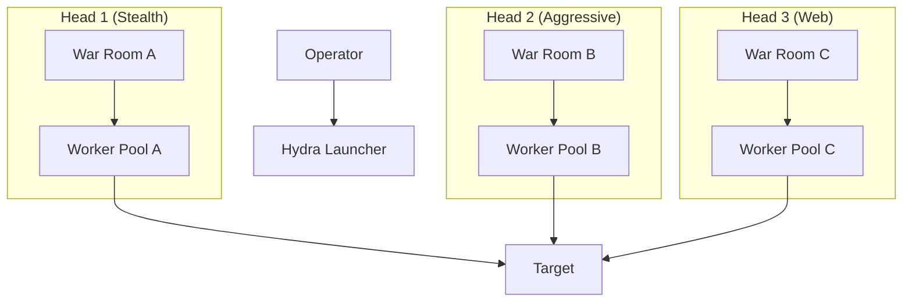

# Architecture Document: Cyber-Red Unleashed (v2.0)

## 1. System Overview
Cyber-Red follows a **Hydra Architecture**. It supports running multiple independent "Heads" (Swarms) from a single server to simulate multi-actor attacks.

### High-Level Diagram

## 2. Component Design

### 2.1. The War Room (Cognitive Core)
Replaces the voting Council with a **Sequential Chain of Thought**:
1.  **Architect (Llama 3.1 405B):** High-level Strategy.
2.  **Ghost (Nemotron/Mistral):** Evasion & Refinement.
3.  **Engineer (Codestral):** Payload Generation.

### 2.2. Governance (God Mode)
*   **Ownership Check:** User confirms ownership at startup.
*   **Auto-Approve:** If owned, Critic allows RCE/SQLi.
*   **Restriction:** Password Cracking is VETOED (Inefficient/Noisy).

### 2.3. Hydra Instances
Each Instance is a separate Docker Compose stack (or isolated namespace):
*   `redis-alpha`, `worker-alpha`
*   `redis-beta`, `worker-beta`
*   **Profile Config:** `config/hydra.yaml` defines the personality of each head.

## 3. TUI v2.0 (The Matrix)
*   **Terminal Stream:** Raw stdout/stderr from containers.
*   **Brain Stream:** Raw internal monologue of the War Room.

