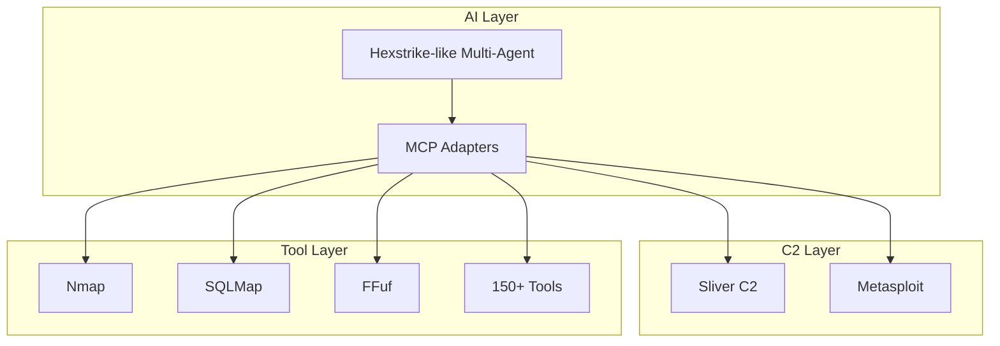

# Framework Analysis: Hexstrike AI and Alternatives

## Executive Summary

This document analyzes **Hexstrike AI** and alternative penetration testing/red team frameworks to inform architectural decisions for the Cyber-Red project. The analysis covers AI-powered frameworks, traditional C2 frameworks, and hybrid approaches.

---

## 1. Hexstrike AI

### Overview
Hexstrike AI is an **open-source, multi-agent AI framework** that bridges LLMs with 150+ security tools for autonomous offensive security operations.

### Key Capabilities
| Feature | Details |
|---------|---------|
| **Architecture** | Multi-agent system with 12+ specialized AI agents |
| **Tool Integration** | 150+ tools (Nmap, SQLMap, Hydra, Ghidra, Metasploit, etc.) |
| **LLM Support** | ChatGPT, Claude, local LLaMA models |
| **Decision Engine** | Autonomous target analysis, tool selection, parameter optimization |
| **Browser Agent** | Headless browser with DOM analysis, traffic monitoring (Burp alternative) |
| **CVE Intelligence** | Real-time CVE monitoring and exploitability analysis |

### Pros
| Advantage | Impact |
|-----------|--------|
| ✅ **Free & Open-Source** | No licensing costs, full code access |
| ✅ **Multi-Agent Architecture** | Parallel task execution, specialized domain agents |
| ✅ **Extensive Tool Coverage** | 150+ tools across recon, exploitation, RE, OSINT |
| ✅ **LLM Flexibility** | Works with commercial and local LLMs |
| ✅ **Autonomous Operations** | Minimal human intervention required |
| ✅ **Resilient Design** | Built-in retry logic and failure recovery |
| ✅ **MCP Integration** | Model Context Protocol for LLM-tool bridging |

### Cons
| Disadvantage | Risk Level |
|--------------|------------|
| ❌ **Dual-Use Concerns** | 🔴 High - Actively weaponized by threat actors |
| ❌ **Community Maturity** | 🟡 Medium - Smaller community than established tools |
| ❌ **Documentation** | 🟡 Medium - Less comprehensive than commercial alternatives |
| ❌ **No Commercial Support** | 🟡 Medium - Community-only support |
| ❌ **Reputational Risk** | 🔴 High - Association with malicious use |

---

## 2. Alternative AI-Powered Frameworks

### 2.1 PentestGPT

| Aspect | Details |
|--------|---------|
| **Type** | AI-powered pentesting assistant/guide |
| **Cost** | Free (Open-Source) |
| **Automation** | Guidance only - does NOT execute tools |
| **LLM** | GPT-4 based |

#### Pros
- ✅ Educational value - great for learning
- ✅ Structured task management
- ✅ Natural language interface
- ✅ Safe - no direct system interaction

#### Cons
- ❌ **No tool execution** - requires manual intervention
- ❌ Limited contextual awareness
- ❌ Not autonomous - human must run all commands

> [!NOTE]
> Best suited for: Training, education, manual pentesting assistance

---

### 2.2 ReaperAI

| Aspect | Details |
|--------|---------|
| **Type** | Autonomous web application security testing agent |
| **Cost** | Free (Open-Source) |
| **Automation** | Full web app pentesting workflow |
| **Focus** | Web applications, bug bounties |

#### Pros
- ✅ End-to-end web app testing automation
- ✅ Reconnaissance through exploitation
- ✅ AI-driven command generation and error handling
- ✅ Open-source and actively developed

#### Cons
- ❌ Limited to web application testing
- ❌ Still proof-of-concept maturity
- ❌ Occasional scope creep / tool misuse
- ❌ Smaller ecosystem than Hexstrike

---

## 3. Traditional C2 Frameworks

### 3.1 Cobalt Strike

| Aspect | Details |
|--------|---------|
| **Type** | Commercial adversary simulation platform |
| **Cost** | ~$5,900/year (requires vetting) |
| **Reputation** | Industry standard for red teams |

#### Pros
- ✅ **Industry Standard** - Widely recognized and trusted
- ✅ **Beacon Payload** - Powerful post-exploitation
- ✅ **Malleable C2** - Customizable network indicators
- ✅ **Team Collaboration** - Built-in team server
- ✅ **Comprehensive Reporting** - Professional output
- ✅ **Commercial Support** - Enterprise-grade support

#### Cons
- ❌ **Expensive** - $5,900+/year
- ❌ **Vetting Required** - Lengthy approval process
- ❌ **Detection Signatures** - Well-known by defenders
- ❌ **Closed Source** - No code access
- ❌ **Threat Actor Abuse** - Commonly used by adversaries

---

### 3.2 Sliver

| Aspect | Details |
|--------|---------|
| **Type** | Open-source adversary emulation framework |
| **Cost** | Free (Open-Source) |
| **Developer** | Bishop Fox |

#### Pros
- ✅ **Free & Open-Source** - No licensing costs
- ✅ **Cross-Platform** - Windows, Linux, macOS
- ✅ **Multiple C2 Channels** - mTLS, WireGuard, HTTP(S), DNS
- ✅ **Dynamic Implants** - Unique signatures per build
- ✅ **Active Development** - Strong community
- ✅ **OPSEC Focus** - Code obfuscation, compile-time changes

#### Cons
- ❌ Less mature than Cobalt Strike
- ❌ Smaller community and ecosystem
- ❌ Less polished UI/UX
- ❌ Fewer integrations with commercial tools

---

### 3.3 Metasploit Framework

| Aspect | Details |
|--------|---------|
| **Type** | Penetration testing framework |
| **Cost** | Free (Community) / ~$15,000/year (Pro) |
| **Developer** | Rapid7 |

#### Pros
- ✅ **Extensive Exploit Database** - Largest collection
- ✅ **Community Edition Free** - Great for learning
- ✅ **Mature Ecosystem** - 20+ years of development
- ✅ **Strong Documentation** - Excellent resources
- ✅ **Meterpreter** - Powerful post-exploitation

#### Cons
- ❌ **Pro Edition Expensive** - ~$15,000/year
- ❌ Well-known signatures (detection)
- ❌ Less sophisticated C2 than Cobalt Strike
- ❌ Limited adversary simulation features

---

### 3.4 Havoc / Brute Ratel C4

| Framework | Type | Cost | Key Differentiator |
|-----------|------|------|-------------------|
| **Havoc** | Modern C2 | Free | Advanced evasion, modular implants |
| **Brute Ratel C4** | Commercial C2 | ~$2,500/year | OPSEC-focused, EDR bypass |

---

## 4. Comparison Matrix

| Feature | Hexstrike AI | PentestGPT | ReaperAI | Cobalt Strike | Sliver | Metasploit |
|---------|:------------:|:----------:|:--------:|:-------------:|:------:|:----------:|
| **Cost** | Free | Free | Free | $5,900/yr | Free | Free/$15K |
| **AI-Powered** | ✅ | ✅ | ✅ | ❌ | ❌ | ❌ |
| **Autonomous Execution** | ✅ | ❌ | ✅ | ❌ | ❌ | ❌ |
| **Multi-Agent** | ✅ | ❌ | ❌ | ❌ | ❌ | ❌ |
| **Tool Count** | 150+ | - | 10+ | 20+ | 15+ | 1000+ |
| **C2 Capabilities** | ⚠️ | ❌ | ⚠️ | ✅✅✅ | ✅✅ | ✅ |
| **Community Size** | Small | Medium | Small | Large | Medium | Very Large |
| **Documentation** | Medium | Good | Basic | Excellent | Good | Excellent |
| **Commercial Support** | ❌ | ❌ | ❌ | ✅ | ❌ | ✅ (Pro) |
| **Detection Risk** | Low | N/A | Low | High | Medium | High |

---

## 5. Recommendations for Cyber-Red

### Approach: Hybrid Multi-Framework Architecture

Given Cyber-Red's goals (nation-state level simulation with HAMAS architecture), we recommend:

### Recommended Components

| Layer | Recommendation | Rationale |
|-------|---------------|-----------|
| **AI Orchestration** | Custom (Hexstrike-inspired) | Avoid reputational risk, maintain control |
| **C2 Framework** | Sliver (primary) | Free, modern, OPSEC-focused |
| **Exploitation** | Metasploit Community | Extensive exploit library |
| **Tool Integration** | MCP Adapters | Already implemented in Cyber-Red |

### Key Takeaways

1. **Don't adopt Hexstrike directly** - Reputational risk due to threat actor adoption
2. **Adopt the architecture** - Multi-agent + MCP pattern is sound
3. **Sliver over Cobalt Strike** - Cost savings, similar capabilities
4. **Metasploit for exploits** - Unmatched exploit database
5. **Custom governance** - Cyber-Red's "Iron Triangle" approach is unique value-add

---

## 6. Risk Assessment

| Risk | Mitigation |
|------|------------|
| Hexstrike association | Build custom framework inspired by architecture |
| Tool detection | Use Sliver's dynamic implant generation |
| Scope creep | Enforce RoE via Critic module |
| LLM hallucination | Human-in-the-loop approval gates |

---

## References

- [Hexstrike AI](https://github.com/hexstrike/hexstrike-ai)
- [Sliver C2](https://github.com/BishopFox/sliver)
- [Metasploit](https://www.metasploit.com/)
- [Cobalt Strike](https://www.cobaltstrike.com/)
- [MITRE ATT&CK](https://attack.mitre.org/)
